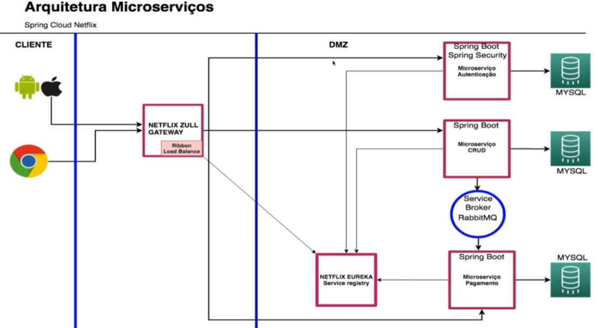

# Spring Boot Microservices

> Projeto demo de pagamento utilizando Spring Cloud Netflix.

## Technologies

- Spring Boot
- Spring Data e Security
- Netflix Eureka Server (Service registry)
- Netflix Zuul (Gateway)
- RabbitMQ (Service Broker)
- Docker

    

